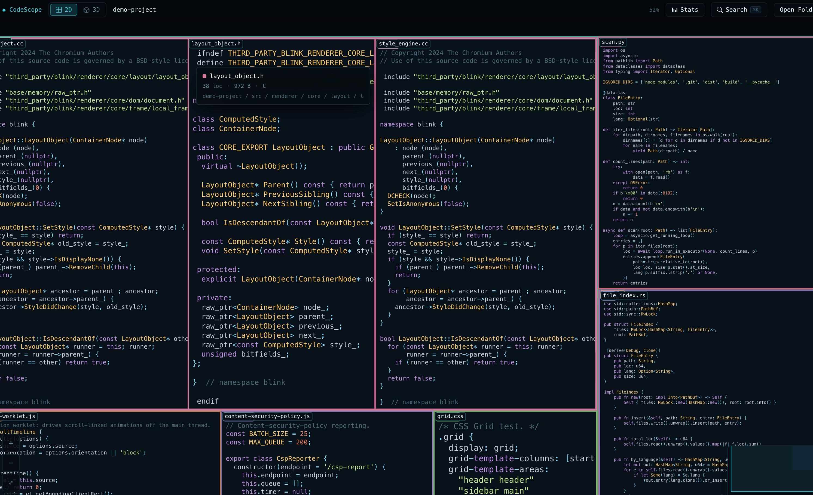

# CodeScope

Interactive codebase visualizer — drop this single HTML file anywhere, open in Chrome, and see any project as a zoomable 2D blueprint or 3D code city.

## Live demo

**→ [kibevoder.github.io/codescope](https://kibevoder.github.io/codescope/)**

## What it does

- Reads any folder on your machine via the File System Access API — no upload, no server, no install
- Renders the whole tree as a **squarified treemap** — block size = lines of code
- Files render their **actual source code** inside the block as you zoom in
- **⌘K search** · hover tooltips · clickable breadcrumbs · stats panel · minimap
- Toggle between **2D blueprint** and **3D code city** with `2` / `3`
- Everything in **one HTML file**. No build step. Three.js from CDN.

## Try it

1. Download `index.html` from this repo
2. Double-click it — opens in Chrome
3. Click **Open Folder** → pick any project on your machine
4. Explore

Or use the [live demo](https://kibevoder.github.io/codescope/) and pick a folder from there.

## Keyboard shortcuts

| Key | Action |
|---|---|
| `⌘K` / `Ctrl K` | Search files |
| `2` / `3` | 2D / 3D mode |
| `S` | Toggle stats panel |
| `V` | Reset view |
| `0` | Fit whole map |
| `+` / `−` | Zoom in / out |
| `Esc` | Up one level |
| `?` | Help overlay |

## How it works

- **Scanner** — File System Access API → recursive walk → fast byte-counting for LOC
- **Layout** — `squarify()` implementation for balanced rectangles
- **Rendering** — Canvas 2D with progressive level-of-detail (colored bars → syntax-highlighted text as you zoom)
- **3D** — Three.js with lazy code-texture upgrades when the camera gets close
- **Tokenizer** — ~150 lines, no Prism / highlight.js, handles C++ / JS / Python / Rust / CSS / HTML / JSON

## Limitations

- Folder picker needs Chromium (Chrome, Edge). Firefox / Safari see a warning.
- Files are read locally and never sent anywhere.
- Caps at 20,000 files and 2 MB per file.

## License

MIT
